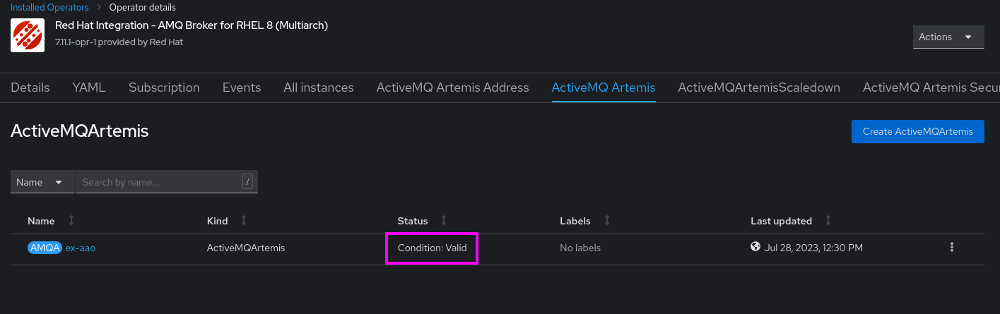
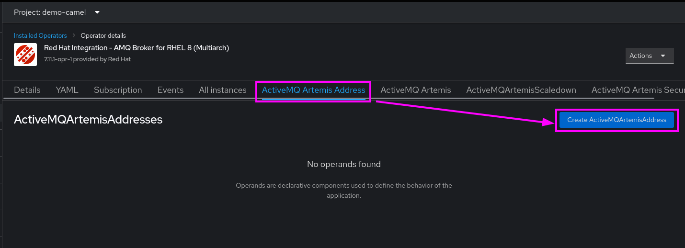
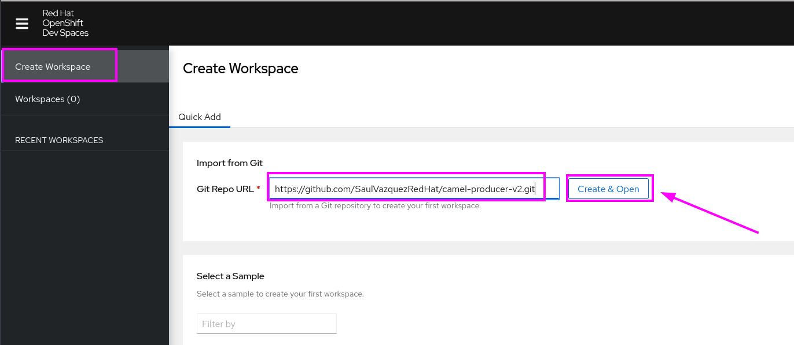
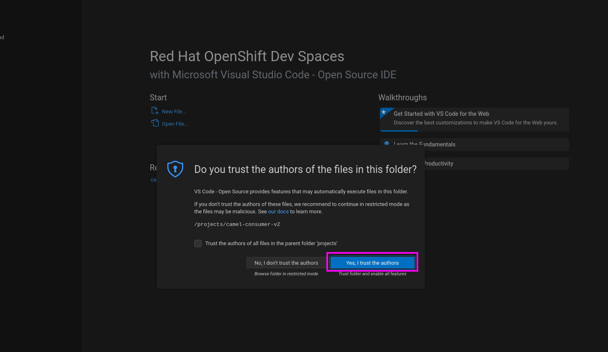
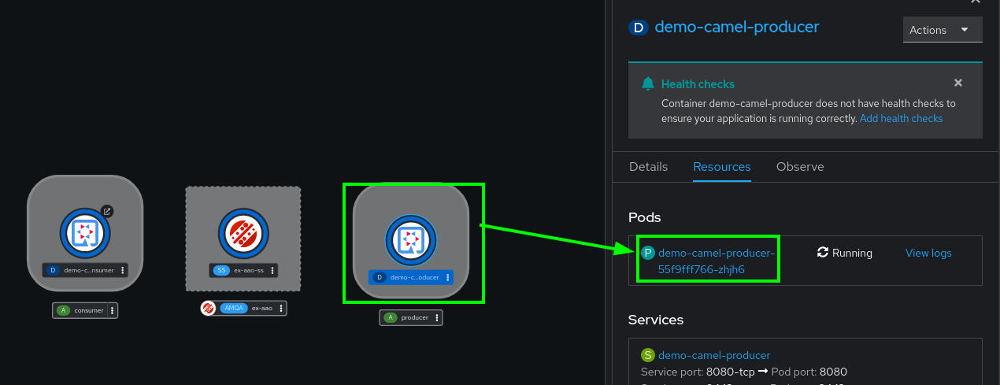
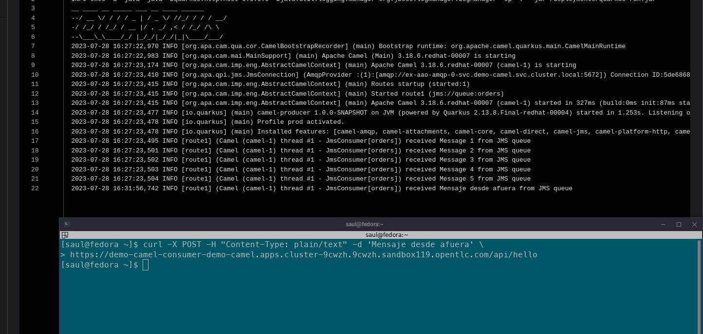
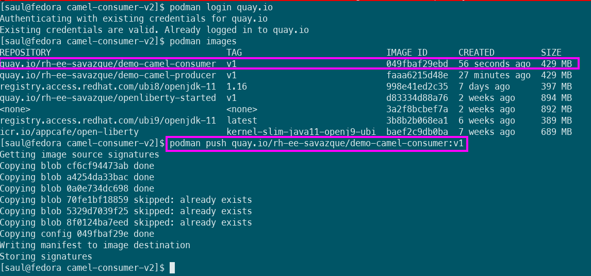

# demo-camel-amq-broker-quarkus
Repositorios:

[https://github.com/SaulVazquezRedHat/demo-camel-amq.git](https://github.com/SaulVazquezRedHat/demo-camel-amq.git)

[https://github.com/SaulVazquezRedHat/camel-producer-v2.git](https://github.com/SaulVazquezRedHat/camel-producer-v2.git)

[https://github.com/SaulVazquezRedHat/camel-consumer-v2.git](https://github.com/SaulVazquezRedHat/camel-consumer-v2.git)

quay.io/rh-ee-savazque/demo-camel-producer:v1

quay.io/rh-ee-savazque/demo-camel-consumer:v1

1\. Creación del proyecto
-------------------------

Primero se crea un proyecto llamado:

Name:

**demo-camel**

Display name:

**Demo Camel with Quarkus and AMQ Broker**


2\. Instalación de operadores
-----------------------------

Se instala el operador de AMQ Broker


Update channel:

**7.11.x**

Installation mode:

**A specific namespace on the cluster**

Installed Namespace:

**demo-camel**


Esperamos a que se termine de instalar.


Se instala el operador de Dev Spaces desde el Operator Hub


En mi caso, dejo los valores por default. 


Espero a que se termine de instalar.


3\. Configuración de AMQ Broker
-------------------------------

Los archivos de configuración se encuentran en el repositorio:

[https://github.com/SaulVazquezRedHat/demo-camel-amq.git](https://github.com/SaulVazquezRedHat/demo-camel-amq.git)

### Creación de cluster de AMQ Broker

Abrimos el operador


Creamos un nuevo componente de **ActiveMQ Artemis**


Creamos el broker a partir del siguiente YAML `broker_activemqartemis_cr.yaml`

```text-plain
apiVersion: broker.amq.io/v1beta1
kind: ActiveMQArtemis
metadata:
  name: ex-aao
  application: ex-aao-app
  namespace: demo-camel
spec:
  deploymentPlan:
    size: 1
    image: placeholder
    requireLogin: false
    persistenceEnabled: false
    journalType: nio
    messageMigration: false
    resources:
      limits:
        cpu: 500m
        memory: 1024Mi
      requests:
        cpu: 250m
        memory: 512Mi
    storage:
      size: "4Gi"
    jolokiaAgentEnabled: false
    managementRBACEnabled: true
  console:
    expose: true
  acceptors:
    - name: amqp
      protocols: amqp
      port: 5672
      sslEnabled: false
      enabledProtocols: TLSv1,TLSv1.1,TLSv1.2
      needClientAuth: true
      wantClientAuth: true
      verifyHost: true
      sslProvider: JDK
      sniHost: localhost
      expose: true
      anycastPrefix: jms.queue.
      multicastPrefix: /topic/
  connectors:
    - name: connector0
      host: localhost
      port: 22222
      sslEnabled: false
      enabledProtocols: TLSv1,TLSv1.1,TLSv1.2
      needClientAuth: true
      wantClientAuth: true
      verifyHost: true
      sslProvider: JDK
      sniHost: localhost
      expose: true
  upgrades:
      enabled: false
      minor: false
```


Esperamos a que el estatus cambie a **Ready**.




Creamos un nuevo componente de **ActiveMQ Artemis Address**



Creamos el broker a partir del siguiente YAML `broker_activemqartemisaddress_cr.yaml`

```text-plain
apiVersion: broker.amq.io/v1beta1
kind: ActiveMQArtemisAddress
metadata:
  name: orders
  namespace: demo-camel
spec:
  addressName: orders
  queueName: orders
  routingType: anycast
```


Hemos creado una cola en AMQ Broker que se llama **orders**


4\. Configuración de Red Hat OpenShift Dev Spaces
-------------------------------------------------

Abrimos el operador de Red Hat OpenShift Dev Spaces


Creamos una nuevo cluster.


Dejo los valores por default.


Abro la especificación del cluster


Y esperamos a que aparezca el link de **Red Hat OpenShift Dev Spaces URL.** 

_**Puede tardar alrededor de 10 minutos.**_


5\. Despliegue de artefactos
----------------------------

En este momento, la vista de la topología con los pods desplegados se ve de la siguiente manera.


### a) Opción 1: Despliegue desde Dev Spaces

Creamos workspaces de Dev Spaces

Los creamos a partir de los siguientes repositorios:

```text-plain
https://github.com/SaulVazquezRedHat/camel-producer-v2.git
https://github.com/SaulVazquezRedHat/camel-consumer-v2.git
```

Construimos y desplegamos desde Dev Spaces:

```text-plain
oc project demo-camel
./mvnw clean package -Dquarkus.container-image.build=true
```

#### Creando el productor

Abrir URL de Red Hat OpenShift Dev Spaces


Metemos credenciales


Veremos la siguiente UI.


Creamos un nuevo Workspace de:

[https://github.com/SaulVazquezRedHat/camel-producer-v2.git](https://github.com/SaulVazquezRedHat/camel-producer-v2.git)




Cuando termine de crearse el workspace, va a abrirse un IDE de VS Code.

Click en **Yes, I trust the authors**.


Aquí podemos detenernos a explorar el código, pero para propósitos de este documento voy a continuar directamente con la construcción y despliegue del artefacto. 

Abrimos la terminal:


Construimos y desplegamos con:

```text-plain
oc project demo-camel
./mvnw clean package -Dquarkus.kubernetes.deploy=true
```


Esperamos a que termine.


Y si regresamos a la vista de topología, deberíamos ver los siguiente.


Ahora vamos a construir y desplegar el consumidor.

Abrimos la UI de Red Hat OpenShift Dev Spaces. Y creamos un nuevo Workspace de:


Esperamos a que se termine de generar el workspace.


Click en **Yes, I trust the authors**.



Nuevamente, voy a pasar directo a la compilación y despliegue.

Construimos y desplegamos con:

```text-plain
oc project demo-camel
./mvnw clean package -Dquarkus.kubernetes.deploy=true
```


Esperamos a que termine.


Y si regresamos a la vista de topología, deberíamos ver los siguiente.


### b) Opción 2: Despliegue desde registro externo (quay.io)

#### Desplegando Producer

Se va a desplegar desde u container image


Este es el registry desde el que se va a desplegar

```text-plain
quay.io/rh-ee-savazque/demo-camel-producer:v1
```

Image name from external registry

**quay.io/rh-ee-savazque/demo-camel-producer:v1**

Runtime icon

**quarkus**

Application

**Create application**

Application name

**producer**

Name

**demo-camel-producer**

Target port

**8080**

Create a route


Click en **Create**


#### Desplegando Consumer

Se va a desplegar desde u container image


Este es el registry desde el que se va a desplegar

```text-plain
quay.io/rh-ee-savazque/demo-camel-consumer:v1
```

Image name from external registry

**quay.io/rh-ee-savazque/demo-camel-consumer:v1**

Runtime icon

**quarkus**

Application

**Create application**

Application name

**consumer**

Name

**demo-camel-consumer**

Target port

**8080**

Create a route


Click en **Create**


Al final, deberíamos terminar con algo así en topología.


6\. Pruebas
-----------

### Probando dentro del cluster

Se debe tener una vista de Topology así:


Abrimos la UI de AMQ Broker.

Buscamos la ruta de nomobre **ex-aao-wconsj-0-svc-rte** y abrimos el link de Location


Credenciales:

Username:

redhat

Password:

redhat


Y en la sección de colas, vemos que hay un consumidor conectado.


Abrimos la **Terminal** del consumer.


Consumir servicio REST desde **dentro** del cluster:

```text-plain
curl -X POST -H "Content-Type: plain/text" -d 'Message from consumer' http://localhost:8080/api/hello
```


Abrimos los Logs del productor




### Prueba de persistencia de mensajes

Se escala a cero el pod que consume mensajes


Vemos que ya no hay consumidores conectados a AMQ Broker


Enviamos mensajes


Se tienen los 5 mensajes en el broker en la cola


Creamos un pod que los consuma


Y revisamos sus logs


### Envió de mensajes desde afuera del cluster

Se pueden enviar mensajes hacia la ruta del endpoint REST.

Recuperamos la ruta del consumidor:


Hacemos una consulta con **curl**

```text-plain
curl -X POST -H "Content-Type: plain/text" -d 'Mensaje desde afuera' \
https://demo-camel-consumer-demo-camel.apps.cluster-9cwzh.9cwzh.sandbox119.opentlc.com/api/hello
```




Apéndice A: Construcción de las imágenes  
------------------------------------------

A continuación se muestra el proceso de creación de las imágenes del registro de quay.io.

Se clona el repositorio:

[https://github.com/SaulVazquezRedHat/camel-producer-v2.git](https://github.com/SaulVazquezRedHat/camel-producer-v2.git)

```text-plain
git clone https://github.com/SaulVazquezRedHat/camel-producer-v2.git
```


Se construyen los artefactos:

```text-plain
cd camel-producer-v2/
./mvnw clean compile package
```


Se construye la imagen

```text-plain
podman version
podman build -f src/main/docker/Dockerfile.jvm -t quay.io/rh-ee-savazque/demo-camel-producer:v1 .
```


Inicio sesión para subir imagen

```text-plain
podman login quay.io
```


Subiendo imagen a registro.

```text-plain
podman push quay.io/rh-ee-savazque/demo-camel-producer:v1
```


Y lo mismo aplica para el repositorio

[https://github.com/SaulVazquezRedHat/camel-consumer-v2.git](https://github.com/SaulVazquezRedHat/camel-consumer-v2.git)


